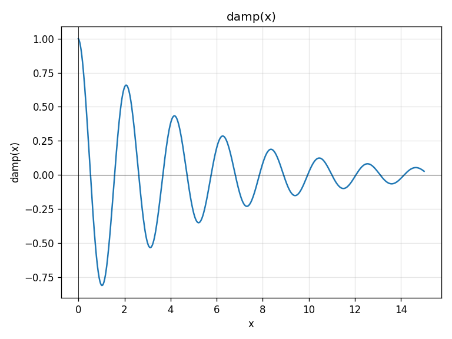
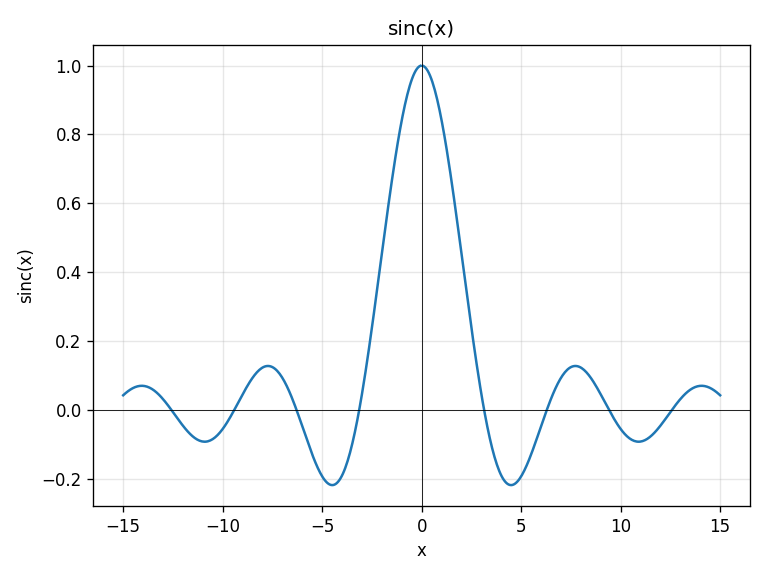
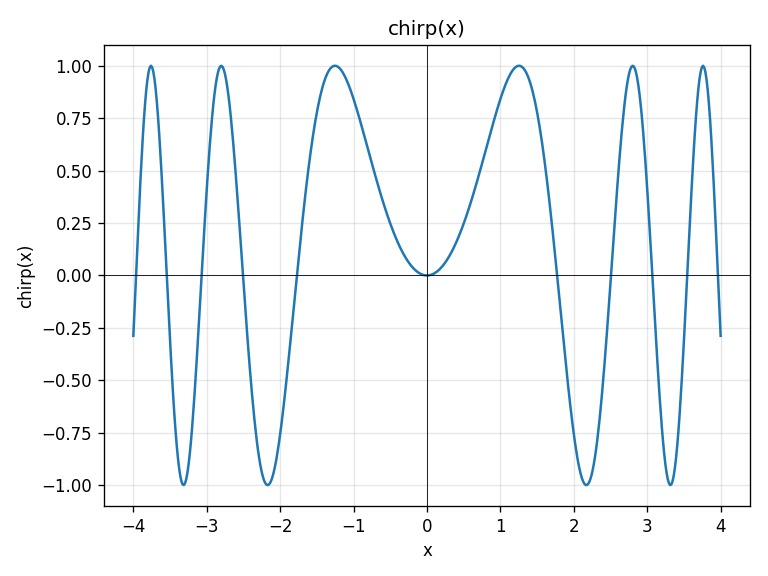
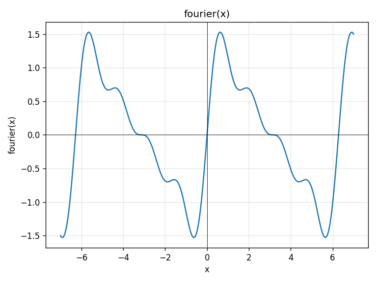
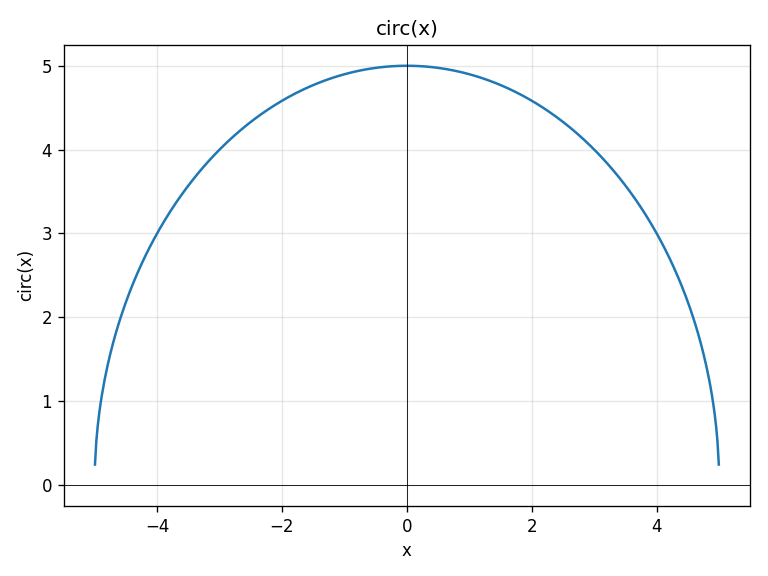
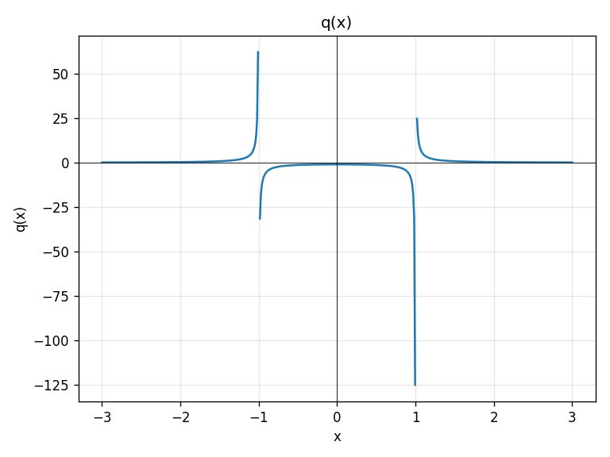

# computor-v2

Интерактивный интерпретатор математических выражений с поддержкой рациональных чисел, комплексных чисел, матриц, функций и решения полиномиальных уравнений до 2-й степени.

---

## Требования к продукту

- Поддержка математических типов: рациональные числа (ℚ), комплексные числа, матрицы, функции одной переменной
- Присвоение переменных и переприсвоение с изменением типа
- Вычисление выражений: `expr = ?`
- Решение уравнений степени ≤ 2: `f(x) = 0 ?` и `ax^2 + bx + c = 0 ?`
- Символьная композиция функций: `f(g(x)) = ?`
- Построение графика функции: `plot f`
- Встроенные функции: `sqrt`, `abs`, `sin`, `cos`, `tan`, `exp`
- Команды: `vars` (список переменных), `exit`
- Режим файла: `uv run computor -f script.txt`
- Режим отладки с логированием: `-d`

---

## Архитектура

```
user input
    |
    v
ImplicitMultiplyLexer   -- оборачивает PLY Lexer, вставляет неявный *
    |
    v
PLY yacc parser  ->  AST Node
    |
    v
Dispatcher
    |
    +-- присвоение переменной  ->  Interpreter -> Store -> Formatter
    |
    +-- определение функции    ->  Normalizer  -> Store -> Formatter
    |
    +-- вычисление (= ?)       ->  Interpreter (или Normalizer, если свободная переменная) -> Formatter
    |
    +-- решение уравнения      ->  Interpreter + Normalizer + PolynomialSolver -> Formatter
    |
    v
вывод строки
```

### Модули

| Модуль | Назначение |
|--------|-----------|
| `parsing/lexer.py` | PLY-лексер + InjectMultiply для `2x` → `2 * x` |
| `parsing/parser.py` | PLY-грамматика → AST |
| `parsing/AST.py` | Иерархия узлов AST |
| `types.py` | `Rational`, `Complex`, `Irrational`, `Matrix`, `Function` |
| `interpreter.py` | Рекурсивный вычислитель AST |
| `normalizer.py` | Свёртка константных подвыражений |
| `solver.py` | Решатель полиномов (степень 0–2) |
| `formatter.py` | Форматирование всех типов |
| `dispatcher.py` | Маршрутизация AST-узлов |
| `store.py` | Хранилище переменных (case-insensitive) |
| `builtins/` | Встроенные константы и функции |
| `plotter.py` | Построение графиков через matplotlib |
| `computorv2.py` | Точка входа: парсинг + диспетчеризация |
| `main.py` | CLI: REPL / файловый режим / отладка |

### Типы данных

| Тип | Примеры значений |
|-----|-----------------|
| `Rational` | `2`, `-4.3`, `1/3 → 0.333333333` |
| `Complex` | `3 + 2i`, `-4 - 4i` |
| `Matrix` | `[[1, 2]; [3, 4]]` |
| `Function` | `f(x) = 2*x^2 - 5` |
| `Irrational` | `√2`, `(1 + √7 * i) / 2` |

---

## Установка и запуск

### Локально (uv)

```bash
# Установить uv
pip install uv

# Клонировать и установить зависимости
git clone https://github.com/kosyan62/computor_v2.git
cd computor_v2
uv sync

# Запустить REPL
uv run computor

# Файловый режим
uv run computor -f examples/showcase.txt

# Режим отладки
uv run computor -d
```

### Docker

```bash
docker build -t computor-v2 .

# Интерактивный REPL
docker run -it computor-v2

# Файловый режим
docker run -i computor-v2 -f - < examples/showcase.txt

# Режим отладки
docker run -it computor-v2 -d
```

---

## Использование

```
> varA = 2
2
> varB = 4 * varA + 3
11
> f(x) = varA * x^2 - varB * x + 1
f(x) = 2 * x^2 - 11 * x + 1
> f(3) = ?
-14
> f(x) = 0 ?
2x^2 - 11x + 1 = 0
Two solutions in ℝ:
(11 - √113) / 4
(11 + √113) / 4
> g(x) = x + 1
g(x) = x + 1
> f(g(x)) = ?
2x^2 - 7x - 8
> m = [[1,2];[3,4]]
[ 1 , 2 ]
[ 3 , 4 ]
> m ** m = ?
[ 7 , 10 ]
[ 15 , 22 ]
> vars
f(x) = 2 * x^2 - 11 * x + 1
g(x) = x + 1
m = [ 1 , 2 ]\n[ 3 , 4 ]
varA = 2
varB = 11
> plot f
Plotting f(x) on [-10.0, 10.0]
> plot f -2 7
Plotting f(x) on [-2.0, 7.0]
```

### Галерея графиков

Сгенерировано из [`examples/showcase.txt`](examples/showcase.txt):

```bash
COMPUTOR_PLOT_DIR=imgs uv run computor -f examples/showcase.txt
```

| `damp(x) = exp(-x/5) * cos(3x)` | `sinc(x) = sin(x) / x` |
|---|---|
|  |  |

| `chirp(x) = sin(x^2)` | `fourier(x) = Σ sin(kx)/k, k=1..4` |
|---|---|
|  |  |

| `circ(x) = sqrt(25 - x^2)` | `q(x) = 1 / (x^2 - 1)` |
|---|---|
|  |  |

Плоттер сам разрывает кривую на полюсах (`q`) и в точках, где значение не
вещественно (`circ` за краями области определения). При установленной
переменной окружения `COMPUTOR_PLOT_DIR` графики сохраняются в PNG вместо
показа окна.

### Поддерживаемые операторы

| Оператор | Описание |
|----------|----------|
| `+`, `-`, `*`, `/` | Стандартные арифметические |
| `%` | Остаток от деления |
| `//` | Целочисленное деление |
| `^` | Степень (скалярная) |
| `**` | Матричное умножение |
| `= ?` | Вычислить выражение |
| `f(x) = val ?` | Решить уравнение |

---

## Тестирование

```bash
# Запустить все тесты
uv run pytest tests/ -v

# С отчётом о покрытии
uv run pytest tests/ --cov=computor_v2 --cov-report=term-missing
```

**Результаты:** 10 616 тестов, 0 failures.

Тесты покрывают:
- Все типы данных и операции над ними (`test_types.py`)
- Лексер и парсер (`test_parser.py`, `test_lexer.py`)
- Вычислитель и нормализатор (`test_interpreter.py`, `test_normalizer.py`)
- Диспетчер: присвоение, запросы, решение уравнений (`test_dispatcher.py`)
- Форматтер и хранилище (`test_formatter.py`, `test_store.py`)
- Встроенные функции (`test_builtins.py`)
- Функциональные тесты через `-f` и stdin (`test_functional.py`)
- Все примеры из задания (`test_subject_examples.py`)

---

## CI/CD

GitHub Actions запускается при каждом push и pull request в ветку `master`:

```
.github/workflows/ci.yml
  ├── test (ubuntu-latest, python 3.13)
  │     ├── uv sync
  │     ├── pytest tests/ -v
  │     └── ruff check .
  └── build (needs: test)
        ├── uv build          # wheel + sdist
        └── upload-artifact   # computor-v2-dist
```

Статус CI: [](https://github.com/kosyan62/computor_v2/actions/workflows/ci.yml)

---

## Режим отладки

```bash
uv run computor -d
```

В debug-режиме (`-d`) все события логируются в stdout через модуль `logging`:

```
[DEBUG] computor_v2: Debug mode enabled. Args: Namespace(debug=True, file=None)
> x = 2 * 4 + 1
[DEBUG] computor_v2: Input: 'x = 2 * 4 + 1'
[DEBUG] computor_v2: AST: Equality
[DEBUG] computor_v2: Result: '9'
9
```

---

## Стек технологий

| Компонент | Технология |
|-----------|-----------|
| Язык | Python 3.13 |
| Парсер | PLY (Python Lex-Yacc) |
| Графики | matplotlib + PyQt5 |
| Тесты | pytest |
| Линтер | ruff |
| Менеджер пакетов | uv |
| CI/CD | GitHub Actions |
| Контейнеризация | Docker |